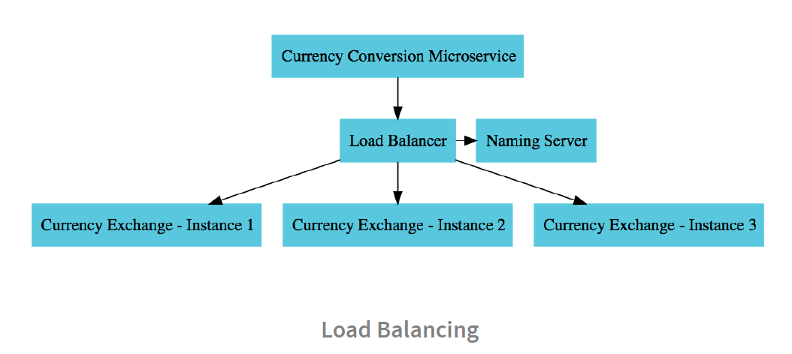

## To implement feign client follow below steps

1. Add below dependency to the pom.xml

`<dependency>
			<groupId>org.springframework.cloud</groupId>
			<artifactId>spring-cloud-starter-openfeign</artifactId>
		</dependency>`
2. Add @EnableFeignClients annotation on the @SpringBootApplication annotation
3. Create required proxy interface as in CurrencyExchangeProxy.java
4. When multiple instances of exchange-service are running, we get automatic load balancing at feign url
   i.e. http://localhost:8100/currency-conversion-feign/from/USD/to/INR/quantity/10
   but no load balancing at rest template url 
   i.e. http://localhost:8100/currency-conversion/from/USD/to/INR/quantity/10
   When we add eureka client dependency we get the load balancing component in that app which talks to the 
   naming/eureka server to get all instances details of the registered apps in eureka server and then feign 
   client talks to this load balancer component to implement load balancing. This is called client side load balancing
